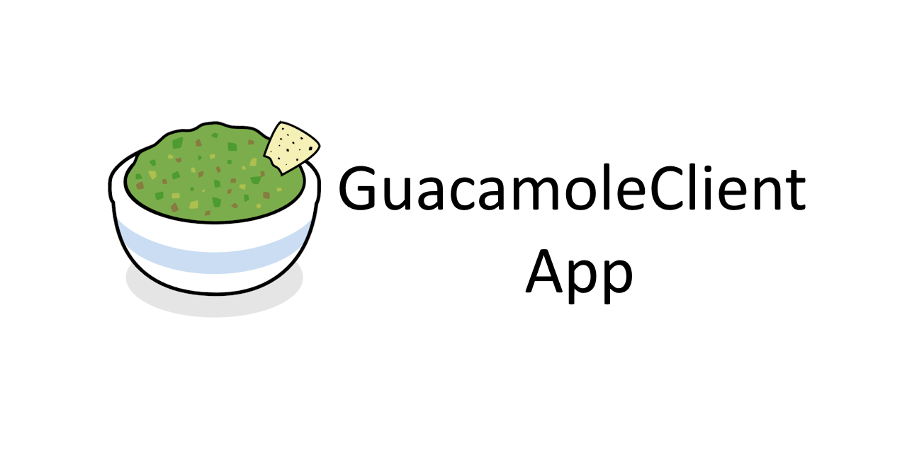
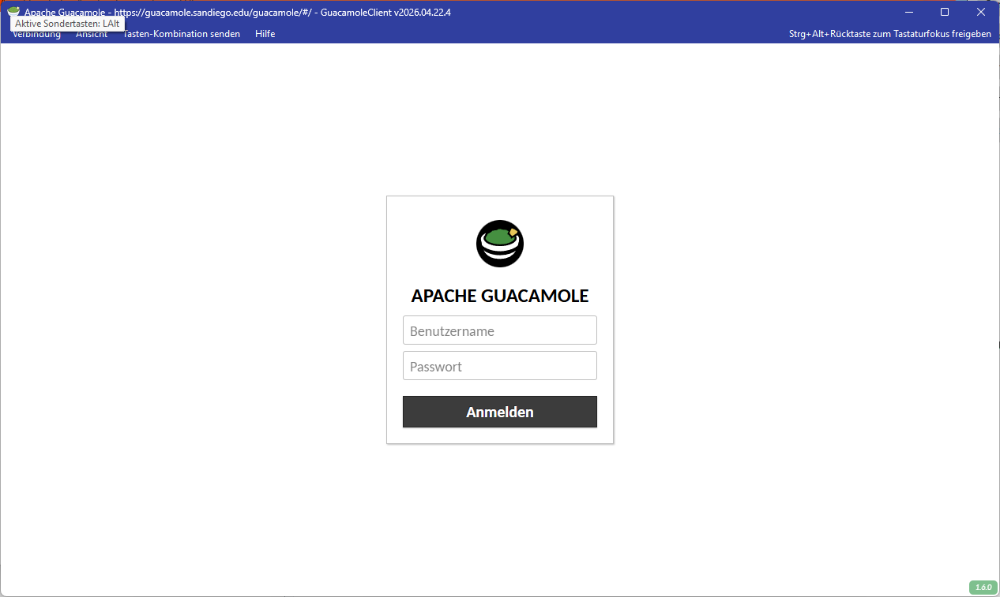
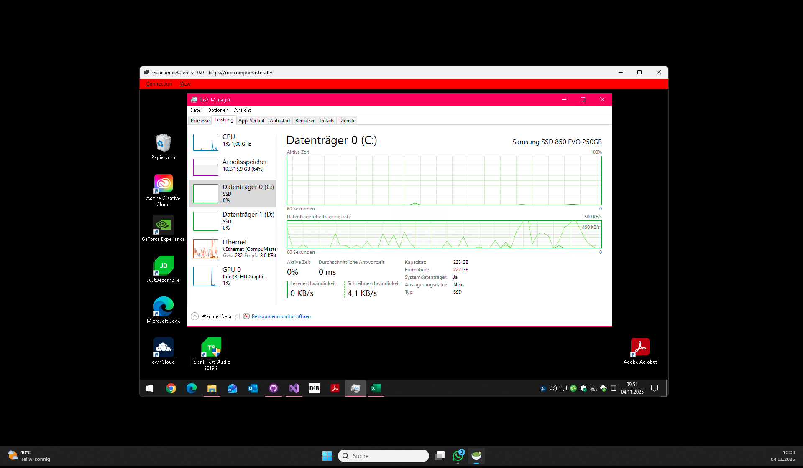
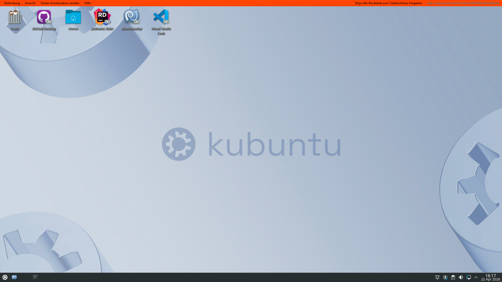
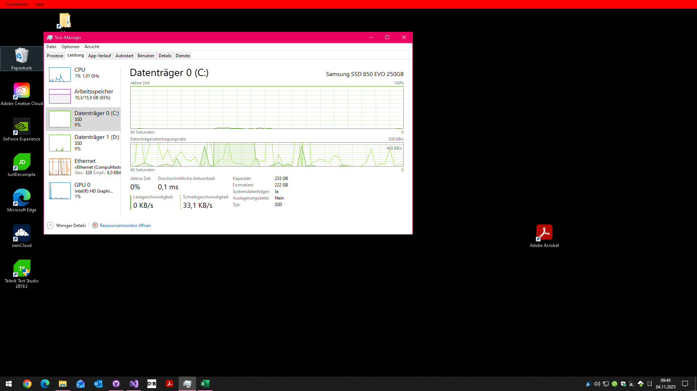
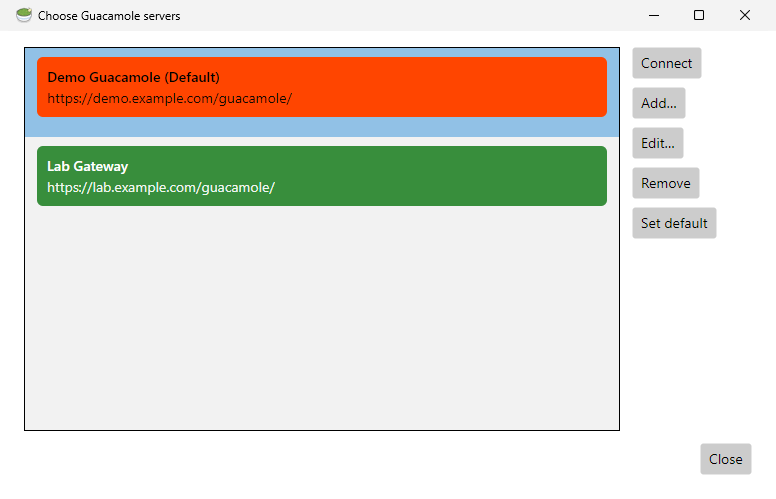
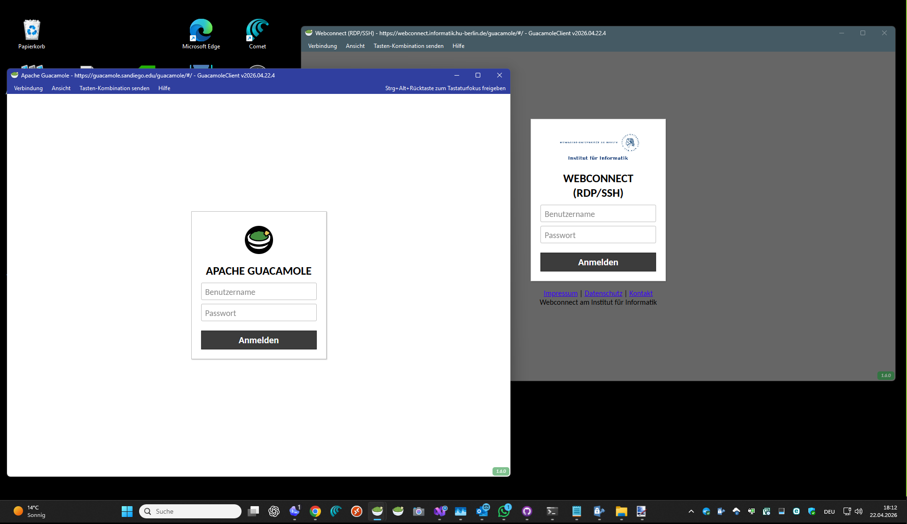

# GuacamoleClient

➡️ **Web-Installer for Windows:** https://jochenwezel.github.io/GuacamoleClient/

## What is GuacamoleClient? Why we need it?

Apache Guacamole is a free, clientless remote desktop gateway. It supports standard protocols like VNC, RDP, and SSH. see https://guacamole.apache.org/
Usually, you access Guacamole via a web browser. However, sometimes using a web browser can lead to conflicts with keyboard shortcuts and other browser-specific behaviors.

* This GuacamoleClient app is more or less a browser control but catching as keyboard shortcuts as much as possible. 
* This allows using of modifier keys and shortcuts like Win+R, Ctrl+Alt+End,
* This also prevents e.g. accidential closing of browser tab (Ctrl+F4) with your guacamole session or the whole browser app (Alt+F4).

## Variants of GuacamoleClient

There are two variants of GuacamoleClient:
1. GuacamoleClient-WinForms: A Windows Forms application 
2. GuacamoleClient-Avalonia: A cross-platform application

### GuacamoleClient-Avalonia

The Avalonia version is a cross-platform application that can run on Windows, Linux, and macOS. 
It is based on Avalonia UI framework and uses the WebViewControl-Avalonia control and the embedded CefGlue browser to embed the Guacamole web interface. 

Please note: platforms Mac and Linux still needs more testing. If you can help, please let us know any issues.

### GuacamoleClient-WinForms

The most complete and stable version is the Windows Forms version. It uses the WebView2 control to embed the Guacamole web interface.

Still this version is under development and therefore lacks several features in comparison to e.g. mstsc.exe or other Remote Desktop clients. It may receive further updates and improvements.

### Screenshots

#### Login screen of Guacamole server

#### Remote Desktop (RDP) session

#### Full screen mode: no visible controls from your own computer

#### Support for multiple Guacamole server profiles

Support environments for multiple customers, stages (e.g. PROD, TEST, etc.) with different color schemes

## Create a test environment for Guacamole Server with docker-compose

If you need a Guacamole Server for testing purposes, you can easily set up a test environment using Docker Compose.
For a quick guide, please refer to the documentation: [SetupTestGuacamoleServer.md](./docs/SetupTestGuacamoleServer.md)

## FAQ, known issues, typical trouble shooting

* issue: on window resize, remote screen resolution doesn't refresh dynamically at some RDP host connections
  * please note: this issue belongs to guacamole server and it's defaults when connecting to a RDP target machine
  * solution: edit connection settings in guacamole (as guacadmin or authorized user), go to section "Screen" and update property "Resize method" to "display-update". Then re-connect to the host.
