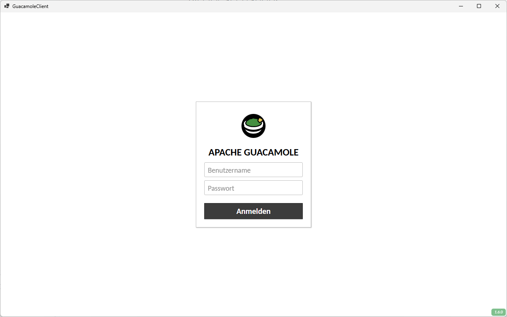

# GuacamoleClient

## What is GuacamoleClient? Why we need it?

Apache Guacamole is a free, clientless remote desktop gateway. It supports standard protocols like VNC, RDP, and SSH. see https://guacamole.apache.org/
Usually, you access Guacamole via a web browser. However, sometimes using a web browser can lead to conflicts with keyboard shortcuts and other browser-specific behaviors.

This GuacamoleClient app is more or less a browser control but catching as keyboard shortcuts as much as possible. 
This prevents e.g. accidential closing of browser tab (Ctrl+F4) with your guacamole session or the whole browser app (Alt+F4).

## Screenshots

